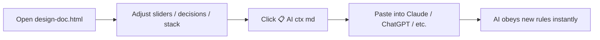
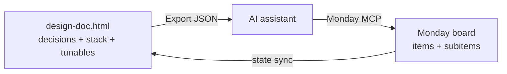

<div align="center">

# 🧭 AI Behavior Spec — Design Doc Toolkit

**A single HTML file + this README = the only "config" your AI assistant needs.**

Non-technical users tweak sliders and toggles → AI follows the new rules → no code, no SDKs, no engineering ticket.


-~1.5K%20tokens-fbbf24)
-~2K%20tokens-fbbf24)


[**Quick Start**](#-quick-start) · [**The Three Controls**](#-the-three-layers-of-control) · [**Daily Loop**](#-the-daily-loop) · [**Edit Recipes**](#-edit-recipes-no-code-needed) · [**FAQ**](#-faq)

</div>

---

## 📦 What's in this repo

| File | Purpose |
|---|---|
| [`design-doc.html`](./design-doc.html) | Interactive specification. Open in any browser. Sliders, decisions, stack picks. |
| [`design-doc-readme.md`](./design-doc-readme.md) | This file. Explains how the HTML controls AI behavior. |
| [`DISCLAIMER.md`](./DISCLAIMER.md) | Scope, third-party terms, user attestation. **Read before connecting any real data.** |
| [`LICENSE`](./LICENSE) | GNU Affero General Public License, version 3 or later. |
| _(your edits)_ | Live in browser `localStorage`. Export via the **⤓ Export** button to share. |

> [!TIP]
> Paired delivery: ship both files together. Humans read the HTML, AI assistants read the markdown.

---

## 🚀 Quick Start



```bash
# 1. Open the HTML (no install — just double-click)
open design-doc.html       # macOS
start design-doc.html      # Windows
xdg-open design-doc.html   # Linux
```

1. **Tweak** any tab: drag a slider, click approve, pick a stack option.
2. Click **📋 AI ctx (md)** in the header — copies a ~1,500-token summary to clipboard.
3. Paste into your AI chat, then ask your question. Done.

> [!NOTE]
> State persists in browser `localStorage`. To share with teammates, click **⤓ Export** (JSON file) or **💾 Save As HTML** (full standalone file).

---

## 💡 The Core Idea

The HTML embeds a JSON-LD schema in a `<script type="application/ld+json">` block. That block is the **single source of truth**. Every visible UI element reads from it. Every AI prompt you paste includes a compact projection of it.

```
┌──────────────────────────┐     ┌────────────────────┐     ┌──────────────────────┐
│ You edit the HTML        │ →   │ Copy AI ctx        │ →   │ AI follows the rules │
│ (clicks, sliders, JSON)  │     │ (md or json)       │     │ in every response    │
└──────────────────────────┘     └────────────────────┘     └──────────────────────┘
```

No SDK. No config file. No deploy. Just a contract the AI reads on demand.

---

## 🎛 The Three Layers of Control

### Layer A — Tunables → numeric knobs

Drag a slider in the **Tunables** tab. AI obeys the new value next time you paste context.

| Slider | Default | What it does | Raise it when… | Lower it when… |
|---|---|---|---|---|
| **Validator tolerance ($)** | `0.00` | Allowed mismatch between your report total and Xero/MYOB control total. | FX rounding, multi-currency. Set `0.05–1.00`. | Audit-grade match required. Keep `0.00`. |
| **Query cache TTL (min)** | `60` | How long AI reuses an OData query before re-fetching. | Slow-changing data, want speed. Set `240+`. | Live dashboards. Set `5–15`. |
| **Regression frequency (hr)** | `24` | How often the golden-set harness runs. | After Xero/MYOB upgrade. Set `6–12`. | Stable system. Set `168` (weekly). |
| **Top-K corrections** | `5` | Past corrections AI sees before each generation. | AI repeats mistakes. Raise to `10–15`. | Stale corrections overwhelm. Drop to `2–3`. |
| **LLM-as-judge weight (0–1)** | `0.30` | Weight of semantic 2nd-AI check vs deterministic math. | Want a "feels right" reviewer. `0.4–0.6`. | Pure math, no opinions. Set `0.00`. |
| **Period lock buffer (days)** | `7` | Warn if query period ends within N days of unlocked range. | Conservative books. `14–30`. | Aggressive real-time. `0–3`. |
| **Token budget** | `32,000` | Max context per AI prompt before summarisation kicks in. | Big multi-entity reports. `64–128K`. | Speed + cost priority. `8–16K`. |

> [!TIP]
> **Real example:** Bookkeeper wants AI to stop blocking her P&L on $0.02 FX rounding. Drags **Validator tolerance** from `0.00` to `0.05`. Next generation passes. No code change.

---

### Layer B — Macro Decisions → binary constraints

Open the **Macro Decisions** tab. Each is a hard rule.

| State | Meaning |
|:-:|---|
| ✅ Approve | AI **must** follow. Bakes into every prompt. |
| ⏸ Hold | AI **asks** you before acting. |
| ❌ Deny | AI **refuses** + explains. |

<details>
<summary><b>Example effects (click to expand)</b></summary>

| Decision | If approved | If denied |
|---|---|---|
| OS keystore for credentials | AI refuses to write creds to `.env`. Routes through Windows Credential Manager / macOS Keychain / libsecret. | AI uses `.env` files (simpler but insecure). |
| Independent Validator (separate process) | AI blocks every report until validator passes. | AI ships unverified output. |
| Second-LLM crosscheck via Codex MCP | Every output reviewed by a 2nd model. Slower, costlier, safer. | Single-model output only. |
| Strict $0.00 validator tolerance | AI never relaxes tolerance without explicit per-report override. | AI may default to permissive tolerance. |
| Notion only for mapping + recipes | AI refuses to write bulk transactional data to Notion. Routes to a real DB. | AI dumps everything in Notion (slow at scale). |

</details>

> [!IMPORTANT]
> **Real example:** Boss approves "Second-LLM crosscheck." Next board pack runs through 2 models. Cost up ~30%, hallucinations down ~70%. One radio button.

---

### Layer C — Stack Matrix → which language AI codes in

Open the **Stack Matrix** tab. One pick per layer.

| Layer | Options |
|---|---|
| MCP Servers | TypeScript · C#/.NET · Python · Rust |
| Output generators | openpyxl (Python) · ClosedXML (C#) · SheetJS (Node) |
| DB Adapters | psycopg · EF Core · pg-mssql · AWS Boto |
| Validator | Python CLI · .NET console · Second-LLM · Deterministic-only |
| Dashboard | Streamlit · Retool · Blazor · Next.js |
| Chatbot frontend | Open WebUI · LibreChat · Semantic Kernel + Blazor · Claude Desktop |

> [!TIP]
> **Real example:** Tech lead picks `C#/.NET` for MCP + Memory + Regression. Asks AI "build me the OdataLink MCP server" — AI returns C# code, not TypeScript. No guessing.

---

## 🔄 The Daily Loop

```
1. Open design-doc.html
2. Adjust anything (slider / approve / pick stack)
3. Click 📋 AI ctx (md)         ← copies ~1.5K tokens
4. Open your AI chat
5. Paste, then ask your question
6. AI obeys all active rules
```

**Paste-ready prompt skeleton:**

````markdown
[paste AI ctx here]

Now: <your task>
````

That's the whole interface. Five clicks per task. Every active decision, slider value, and stack pick is honored.

---

## ✏️ Edit Recipes (no code needed)

> Open the **Schema Editor** tab. Edit JSON in the textarea. **Validate** → **Apply** → optionally **Save As HTML**.

<details>
<summary><b>➕ Add a new decision</b></summary>

```json
{
  "id": "d16",
  "title": "Require human sign-off on any report > $1M revenue",
  "body": "AI generates draft, but cannot send/embed/share until a human approves in Monday.",
  "refs": "policy"
}
```

Add to the `"decisions"` array → **Apply** → new approve/deny radio appears in Macro Decisions tab.
</details>

<details>
<summary><b>➕ Add a new tunable slider</b></summary>

```json
{
  "id": "max_rows",
  "label": "Max rows per query result",
  "min": 50,
  "max": 100000,
  "step": 50,
  "default": 1000,
  "desc": "AI truncates query results to this many rows."
}
```

Add to the `"tunables"` array → **Apply** → new slider appears.
</details>

<details>
<summary><b>🔁 Fork the doc for a new project</b></summary>

1. Schema Editor tab → edit `project.name` and `project.purpose`.
2. Optionally edit decisions, stack layers, tunables to fit the new project.
3. **Save As HTML** → downloads `design-doc-<your-project>.html` with fresh `localStorage` key.

</details>

<details>
<summary><b>🧩 Add a totally new section type (e.g. Risk Register)</b></summary>

1. Add a top-level array in the schema:
   ```json
   "risks": [
     { "id": "r1", "title": "Xero API rate limit", "severity": "high", "owner": "tech lead" }
   ]
   ```
2. Ask any AI assistant:
   > Read `design-doc.html`. Add a "Risks" tab that renders the new `risks` array as a table. Show severity as a coloured pill.
3. AI returns the JS render function + tab markup. Paste, save, done.

</details>

---

## 📝 Sample Prompt Templates

<details>
<summary><b>Template 1 — Generate a report</b></summary>

````markdown
[paste AI ctx]

Build a P&L for July 2025.
Output format: Excel.
Run the validator before showing me. If it fails, show me the diff and the suggested cause.
````
</details>

<details>
<summary><b>Template 2 — Propose a stack change</b></summary>

````markdown
[paste AI ctx]

I'm considering switching the DB Adapter stack from psycopg to EF Core.
- List pros / cons / migration effort.
- Suggest one experiment I can run in a week to de-risk the switch.
````
</details>

<details>
<summary><b>Template 3 — Sanity check the spec</b></summary>

````markdown
[paste AI ctx]

- Are any decisions inconsistent with each other?
- Are any tunables set to risky values for an accounting use case?
- Anything missing for AU GST / BAS compliance?
````
</details>

<details>
<summary><b>Template 4 — Onboard a new team member</b></summary>

````markdown
[paste AI ctx + this README]

Explain this system to a bookkeeper with no engineering background.
One page. Plain English. Focus on what they can change vs what's locked.
````
</details>

---

## ⚖️ Before / After — Same Prompt, Different Behavior

| | **Before** (no spec) | **After** (spec attached) |
|---|---|---|
| **User says** | "Build me a P&L for last month." | "Build me a P&L for last month." (with AI ctx pasted) |
| **Accounts** | AI guesses which to include | Loads full CoA, refuses to skip any (CoA Classifier decision) |
| **Numbers** | May not tie to Xero | Validator subprocess blocks output on mismatch (Validator decision) |
| **Tolerance** | Arbitrary | `0.00` strict (Validator tolerance tunable) |
| **Format** | Random pick | `.xlsx` with native SUM formulas (openpyxl stack pick) |
| **Period** | No warning if unlocked | Warns if within `7` days of unlocked range (Period lock buffer tunable) |
| **Memory** | None | Top-5 past corrections injected (Top-K tunable) |
| **Result** | "Looks right…?" | Validation badge + audit trail |

Same prompt → wildly different output.

---

## 💰 Token Economy

| What you paste | ~Tokens | When to use |
|---|---|---|
| Full `design-doc.html` | 10,000 | **Never** — wastes context |
| JSON-LD ctx (📋 AI ctx (json)) | 2,000 | Tool-using agents, structured prompts |
| **Markdown ctx (📋 AI ctx (md))** | **1,500** | **Daily chat work — best ROI** |
| This README only | 2,000 | Onboarding humans or AI to the system |
| README + Markdown ctx | 3,500 | First-time use, deep / unfamiliar tasks |

> [!TIP]
> **Rule of thumb:** start with **Markdown ctx alone**. Add this README only if AI seems confused about *why* a setting matters.

---

## 🆘 Troubleshooting

| Symptom | Cause | Fix |
|---|---|---|
| AI ignores my settings | Forgot to re-copy ctx after editing | Click **📋 AI ctx (md)** again, paste in a fresh message |
| Old behavior after slider change | Context isn't live; chat only sees what was pasted | Paste new ctx: *"Updated spec — refer to this from now on"* |
| Schema Editor "invalid JSON" | Missing comma / unmatched bracket | Lint with [jsonlint.com](https://jsonlint.com) — finds the exact line |
| Forked doc still has old project name | localStorage changed; HTML not regenerated | Click **💾 Save As HTML** to bake the schema into the file |
| Teammates don't see my decisions | localStorage is per-browser, per-device | Export state JSON → share file, OR Save As HTML → share file |

---

## 🤝 Pairing with Monday.com

The spec references Monday board `5028437706` (AI Apps for ODL users).



**Daily workflow:**
1. Click **⤓ Export** in the HTML.
2. Hand to AI: *"Apply this design state to the Monday board — set matching subitems to Active, archive non-matching ones."*
3. AI uses the Monday MCP server to mutate the board.

Spec state ↔ board state stays in sync.

---

## 📋 Quick Reference Card

```
┌───────────────────────────────────────────────────────────────┐
│  SLIDERS        →  tweak numbers       →  AI stricter/looser   │
│  APPROVE/DENY   →  set binary rules    →  AI obeys/refuses     │
│  STACK MATRIX   →  pick a language     →  AI codes in it       │
│  TO-DO TAB      →  queue deliberations →  approve → plan       │
│  SCHEMA EDITOR  →  add new sections    →  Apply re-renders     │
│  SAVE AS HTML   →  fork for new client →  new file, fresh      │
│  📋 AI CTX (md) →  ~1.5K tokens        →  paste before chat    │
│  📋 AI CTX (json)→ ~2K tokens          →  for tool-use agents  │
└───────────────────────────────────────────────────────────────┘
```

---

## ❓ FAQ

<details>
<summary><b>Do I need to know JSON to use this?</b></summary>

No. Tabs (Decisions / Stack / Tunables / To-Do) are all clicks and sliders. JSON only matters if you want to add a *new type* of control beyond what already exists.
</details>

<details>
<summary><b>Will the AI hallucinate less if I use this?</b></summary>

Yes, indirectly. Three reasons:
1. AI gets explicit rules instead of guessing your intent.
2. The Validator decision (if approved) blocks numerically wrong output.
3. Correction Memory remembers past mistakes per feed.
</details>

<details>
<summary><b>Works with Claude / ChatGPT / Gemini equally?</b></summary>

Yes. Markdown context is plain text — works in any chat. JSON-LD ctx is even better for tool-using agents (Claude Desktop, Cursor, Codex MCP, etc.).
</details>

<details>
<summary><b>My company doesn't use Notion / Monday / OdataLink. Can I still use this?</b></summary>

Yes. Fork the doc. Schema Editor → swap the `"monday"` block references, change `"project.name"`, edit decisions and stack layers to fit your stack. The pattern works for any AI-driven workflow, not just accounting.
</details>

<details>
<summary><b>Where are my changes saved?</b></summary>

Browser `localStorage` per-device by default. For team sharing:
- **⤓ Export** → JSON file → share.
- **💾 Save As HTML** → fully-baked HTML → share.
</details>

<details>
<summary><b>Can the AI edit the doc back at me?</b></summary>

Yes. Ask: *"Propose a JSON delta to add a new decision about X."* AI returns just the JSON snippet. You paste into Schema Editor → Apply.
</details>

<details>
<summary><b>Can I use this offline?</b></summary>

Yes. No CDN dependencies, no API calls, no telemetry. Pure HTML + vanilla JS. Open the file from any disk, USB, or air-gapped machine.
</details>

---

## 🛠 Architecture Notes

<details>
<summary><b>Why JSON-LD as source-of-truth?</b></summary>

- **Standard.** Search engines, schema.org, and AI ingestion tools recognize `<script type="application/ld+json">`.
- **Self-contained.** Living in the HTML means the spec travels with the UI.
- **AI-cheap.** Reading the LD block alone is ~2K tokens vs ~10K for the full file.
- **Editable.** One block to fork the doc for another project.

</details>

<details>
<summary><b>Why no external libraries?</b></summary>

- **Offline.** Works on air-gapped machines.
- **Stable.** No supply-chain risk, no CDN outages, no version drift.
- **Auditable.** ~520 lines of vanilla JS, readable by any engineer.
- **Trade-off:** ~150 lines of custom CSS you'd save with Pico.css. Opt-in line is commented in the HTML head — uncomment if you want it.

</details>

<details>
<summary><b>Why both HTML and Markdown ingestion paths?</b></summary>

- **HTML** = humans (visual, interactive).
- **Markdown ctx** = AI chat (cheap, compact).
- **JSON ctx** = AI tool-use (lossless, structured).

Same source data, three projections. No duplication.

</details>

---

## 📜 License & Scope

This repository is licensed under the **[GNU Affero General Public License, version 3 or later (AGPL-3.0-or-later)](./LICENSE)**.

> [!IMPORTANT]
> **AGPL-3.0 means:**
> - You may freely use, study, modify, and redistribute this work.
> - If you distribute or run a **modified** version (including as a network service), you must release your modifications under the same license and provide source to your users.
> - No part of this license restricts how a user, on their own data, configures or operates their own AI assistant.

**Scope — read this before connecting real data:**

This repository is a **behavior-specification framework**. It does not process, store, transmit, or transform any data, and it does not connect to any third-party service. Every vendor, database, model provider, hosting service, and chatbot frontend named in the schema is an **example**, not an endorsement or a required dependency.

If you connect the framework to any third-party service — Xero, MYOB, QuickBooks, OdataLink, Notion, AWS, Anthropic, OpenAI, a database vendor, a hosting platform, or any other — **you alone are responsible for complying with that service's terms**, fair-use policy, AI/ML restrictions, and any data-handling obligations.

> [!CAUTION]
> **Xero Developer Platform Terms (effective 2 March 2026)** prohibit using Xero API Data to train, fine-tune, adapt, or enhance any AI/ML model, and prohibit passing API Data to a third party without user consent. This framework operates at **inference time only** and does not authorise or facilitate AI model training on any third-party data. See [DISCLAIMER.md](./DISCLAIMER.md) §4 for the full notice.

**Quick decision guide:**

| Use case | Status |
|---|---|
| Fork this repo for your own internal use | ✅ Permitted under AGPL — keep the license |
| Modify and redistribute as a public project | ✅ Permitted under AGPL — distribute your modifications under AGPL-3.0 |
| Run a hosted service based on this repo | ⚠️ Permitted but you must share your source with users (AGPL §13) |
| Embed in a closed-source proprietary product | ❌ Not permitted under AGPL without a separate commercial agreement |
| Use the framework to configure an AI assistant for your own accounting | ✅ Your data, your tools, your choice — comply with your data providers' terms |
| Train, fine-tune, or distill an AI model on Xero/MYOB/QB-originated data | ❌ Not permitted under those providers' terms — not authorised by this framework |

**Full scope, user attestation, and third-party terms: [DISCLAIMER.md](./DISCLAIMER.md).**

---

<div align="center">

**Made for non-technical users who deserve trustworthy AI.**

_File version: `1.1.0` · Last updated `2026-05-14`_

</div>
